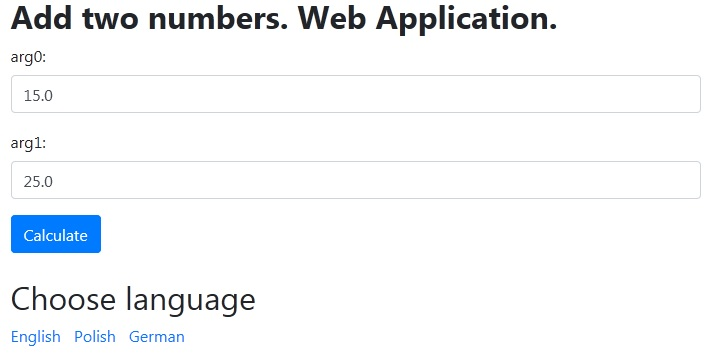

## Table of contents
* [Application name](#application-name)
* [Screenshot](#screenshot)
* [General info](#general-info)
* [Version](#version)
* [Technologies](#technologies)
* [Author](#author)

## Application name
Multilingual adding web application.

## Screenshot

## General info  
Language versions:
* Polish
* English
* German

## Version  
31.05.2020 - **`ver. 1.00`**            
	
## Technologies
Project was created with:
* Java 8
* JavaEE
* HTML5
* XML
* Bootstrap 4.5.0
* JSP
* using server Glassfish 5.0

## Author
Marcin Godlewski
